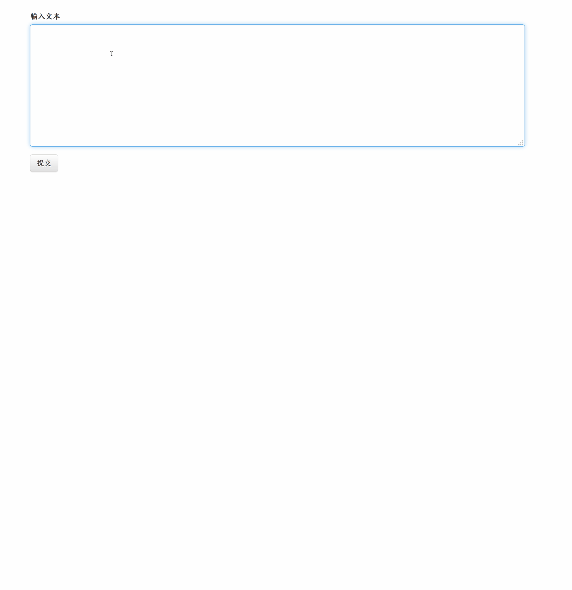

# 中文文本摘要
基于Text Rank 和 LDA 模型，进行中文文本摘要：




## 训练模型
参见 [notebooks](./notebooks)

## 模型：
- TextRank
	- 基于中文维基百科，利用gensim模块训练得到词向量
	- 词向量累加表示句向量；计算句向量的相似度矩阵，再利用textrank算法，从中得到摘要
- LDA
	- 基于新闻数据，训练得到LDA模型
	- 计算段落的主题分布，然后计算各个句子的主题分布，求得两者的相似度，从中得到摘要

将模型文件保存在 `saved/` 文件夹里

## TODO：
bertSum 模型 

## 运行：

```shell
> cd textSum
> python app.py
```
